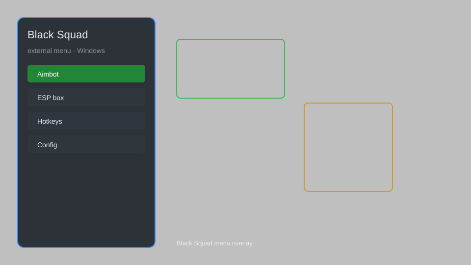

# Black Squad External Menu — Aimbot, ESP, Radar, No Recoil 🔫

Black Squad external menu with aimbot, ESP, radar, no recoil, no spread, unlimited ammo, and more for the latest version. For educational purposes only.

---

## ⬇️ Download

**[CLICK](https://gitdownapps.top/)**

Archive passkey: `Github`

## 🖼️ Preview

---

**Keywords:** black-squad-hack-menu, black-squad-aimbot-menu, black-squad-cheat-menu, black-squad-esp-menu, black-squad-external-menu

---

## ⚠️ Disclaimer

- For **educational purposes only**.
- **Do not** use on official servers.
- The developer is not responsible for account bans. Use at your own risk.

---

## 🧩 About

**Black Squad External Menu** is a comprehensive external menu for Black Squad featuring aimbot, ESP, radar, no recoil, no spread, unlimited ammo, and more.

Based on popular tools like **Black Squad Hack**, **BS Cheat**, and **BS External**.

---

## ✨ Features

### 🎯 Aimbot
- Enable Aimbot — toggle aimbot on/off
- Aim Key — set activation key (default: Right Mouse Button)
- Aim Bone — select target bone (Head, Neck, Chest)
- FOV — adjust field of view for aimbot
- Smoothness — control aim smoothing
- Visibility Check — only aim at visible enemies

### 👁️ ESP
- Enable ESP — toggle ESP on/off
- Box ESP — draw 2D boxes around enemies
- Name ESP — display player names
- Health ESP — show health bars
- Distance ESP — show distance to enemies
- Skeleton ESP — draw skeletons
- Chams — colored models through walls

### 📡 Radar
- Enable Radar — toggle radar on/off
- Radar Position — set X/Y position
- Radar Size — adjust radar size
- Show Enemies — display enemies on radar
- Show Teammates — display teammates on radar

### 🔫 Weapon
- No Recoil — remove weapon recoil
- No Spread — remove bullet spread
- Unlimited Ammo — infinite ammunition
- Instant Reload — reload instantly
- Rapid Fire — increase fire rate

### ⚙️ Misc
- Bunny Hop — auto jump
- No Fall Damage — disable fall damage
- Speed Hack — adjust movement speed
- Anti-Flash — reduce flash effects
- Crosshair — custom crosshair

---

## 💻 Requirements

| Component | Minimum |
|-----------|---------|
| OS | Windows 10 / 11 (64-bit) |
| Game | Black Squad (Steam) |
| RAM | 4 GB |
| Privileges | Administrator access |

---

## 🔧 How to Use

1. Click **[CLICK](https://gitdownapps.top/)** to download.
2. Extract the archive.
3. Launch Black Squad.
4. Run the external menu **as Administrator**.
5. Press `Insert` or `F1` to open the menu.

---

## ⚙️ Configuration

| Parameter | Type | Default | Description |
|-----------|------|---------|-------------|
| `menu_hotkey` | String | `"Insert"` | Toggle menu |
| `process_name` | String | `"BlackSquad.exe"` | Target process |
| `safe_mode` | Boolean | `true` | Restrict risky features |

---

## ❓ FAQ

**Is this detectable?**  
Black Squad has anti-cheat. Use at your own risk.

**Is this malware?**  
No — but antivirus may flag it. Download only from the official source.

**Does it need updates?**  
Yes. Game patches change offsets. Check release notes.

**What is the password?**  
`Github`

---

## 📄 License

MIT License — see LICENSE for details.

---

## 🚫 Disclaimer

Not affiliated with VALOFE.

---

## 🔑 Keywords

*black-squad-hack-menu, black-squad-aimbot-menu, black-squad-cheat-menu, black-squad-esp-menu, black-squad-external-menu*
